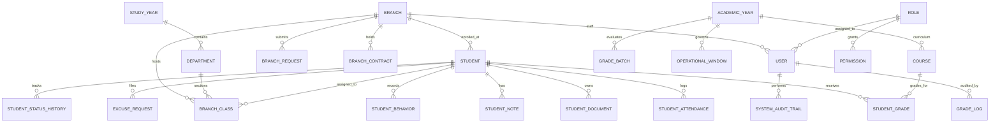

# وثيقة المرجع الشامل ومعمارية النظام البرمجية (System Architecture & Master Prompt Blueprint)
## البوابة الإلكترونية للمعهد التخصصي للعلوم الشرعية — منظومة IIIS Enterprise ERP v2.0

---

> **ملاحظة الاستخدام**: صُممت هذه الوثيقة لتكون **المرجع التقني والوظيفي الأكمل (Context Prompt)** الذي يتم تزويد نماذج الذكاء الاصطناعي (AI Prompting) والمطورين به عند الرغبة في تحديث النظام، إضافة ميزات جديدة، تصحيح الأخطاء، أو إعادة هيكلة أي من وحداته.

---

## 1. نبذة عن النظام والهوية (System Overview & Domain)

- **اسم النظام**: منظومة «المعهد التخصصي للعلوم الشرعية» المركزية (IIIS Enterprise ERP v2.0).
- **الجهة المالكة**: المعهد المتوسط للعلوم الشرعية / المعهد التخصصي للدراسات الإسلامية (تحت إشراف إدارة التعليم الأصيل - ليبيا).
- **الهدف الاستراتيجي**: إدارة الحوكمة الأكاديمية والإدارية والمالية الشاملة لشبكة فروع المعهد التخصصي المنتشرة جغرافياً، بدءاً من تسجيل الطلاب ومتابعة دوامهم، مروراً بالمناهج والامتحانات والكنترول، وصولاً إلى استخراج الشهادات الموثقة وإدارة الأصول والفروع.
- **نمط التشغيل**: نظام مركزي سحابي يربط الإدارة العامة (HQ) بالفروع المحلية، مع إمكانية عزل الصلاحيات حسب الفروع وتطبيق نوافذ زمنية مركزية على العمليات.

---

## 2. البنية التقنية ومعمارية البرمجيات (Tech Stack & Architecture)

### 2.1 المكونات التقنية الأساسية (Core Stack)
- **الخادم الخلفي (Backend Framework)**: Laravel 11.x (PHP 8.2+).
- **قاعدة البيانات (Database)**: SQLite (بيئة العمل الحالية والتطوير) قابلة للترحيل الفوري إلى MySQL / PostgreSQL مع الحفاظ على سلامة القيود والمفاتيح الأجنبية.
- **واجهات البرمجة (APIs)**: نمط هجين RESTful JSON API تحت البادئة `/api/v1/` مدعومة بـ CSRF Protection وجلسات Laravel الآمنة.
- **الواجهة الأمامية (Frontend Presentation)**: 
  - بنية **SPA ديناميكية أحادية الصفحة داخل قوالب Blade** (`resources/views/dashboard.blade.php`).
  - محرك التفاعل والحالة المرجعية: **Alpine.js v3.x** بدوال مركزية (`academicApp()`).
  - التنسيق والتصميم: **Tailwind CSS** مع تخصيص هوية ألوان مخصصة (الأندلسي، الكحلي، البورغندي)، ودعم كامل للوضع الليلي المتقدم (`dark mode`).
  - الخرائط التفاعلية: **Leaflet.js** لعرض مواقع الفروع وإحداثياتها الجغرافية.
  - الطباعة والمخرجات: محرك عزل أطر الطباعة التلقائي (`printCustomHtmlElement - Iframe Isolation`) وفق معايير المستندات الرسمية.

### 2.2 الأنماط المعمارية المطبقة (Design Patterns)
1. **Service-Oriented Architecture (Services Layer)**: فصل المنطق البرمجي الحرج عن وحدات التحكم (Controllers) ونقله إلى طبقة الخدمات المستقلة (`app/Services`).
2. **Single Source of Truth (SSOT)**: مركزية كافة البيانات الإدارية والترويسات الرسمية، حيث يُمنع منعاً باتاً ترميز أي نص ثابت (Hardcoded) لأسماء المسؤولين، التوقيعات، الهيكل الإداري، أو شعار المعهد في قوالب العرض.
3. **Forensic Audit Logging**: كل تعديل على الدرجات أو البيانات الحساسة يخضع لتسجيل جنائي غير قابل للتعديل يوثق (المستخدم، القيمة السابقة، القيمة الحالية، السبب، التوقيت، عنوان الـ IP).
4. **Time-Locked Operational Windows**: قفل العمليات الأكاديمية الحساسة (التسجيل، رصد الأعمال، الامتحانات النهائية، المراجعات والطعون) عبر وسطاء برمجية (Middleware) تمنع التعديل إلا ضمن فترات زمنية محددة من الإدارة المركزية، مع إمكانية استثناء فروع معينة بمبررات معتمدة.

---

## 3. الهيكل الميداني للأدلة والملفات (Directory Structure)

```text
academic_system/
├── app/
│   ├── Http/
│   │   ├── Controllers/
│   │   │   ├── Api/                     # 20 وحدة تحكم API متخصصة
│   │   │   │   ├── AcademicStructureController.php
│   │   │   │   ├── AdminSettingsController.php
│   │   │   │   ├── AuditLogController.php
│   │   │   │   ├── BranchOperationsController.php
│   │   │   │   ├── CourseController.php
│   │   │   │   ├── ExamApprovalController.php
│   │   │   │   ├── FastGradeEntryController.php
│   │   │   │   ├── HQDashboardController.php
│   │   │   │   ├── PermissionMatrixController.php
│   │   │   │   ├── SettingsController.php
│   │   │   │   ├── StudentAttendanceController.php
│   │   │   │   ├── StudentController.php
│   │   │   │   ├── StudentDataQualityController.php
│   │   │   │   ├── StudentFileController.php
│   │   │   │   ├── StudentRegistryReportController.php
│   │   │   │   ├── StudentWorkflowController.php
│   │   │   │   ├── StudyAndExamsController.php
│   │   │   │   ├── SystemErrorMonitoringController.php
│   │   │   │   ├── TranscriptEngineController.php
│   │   │   │   └── UserController.php
│   │   │   └── Auth/
│   │   │       └── LoginController.php
│   │   └── Middleware/
│   │       ├── CheckOperationalWindow.php
│   │       └── EnsureActiveAcademicYear.php
│   ├── Models/                          # 41 نموذج بيانات Eloquent
│   └── Services/                        # محركات الأعمال المركزية
│       ├── AcademicNumberGeneratorService.php
│       ├── AdminSettingsService.php
│       ├── ForensicGradeLoggerService.php
│       ├── GradeCalculationEngineService.php
│       └── SystemErrorMonitoringService.php
├── database/
│   ├── migrations/                      # 29 ملف هجرة منظم تاريخياً
│   └── seeders/
├── docs/                                # التوثيق الفني والمواصفات الرسمية
│   └── official_printing_and_admin_settings/
├── resources/
│   └── views/
│       ├── auth/
│       │   └── login.blade.php
│       └── dashboard.blade.php          # الواجهة المركزية الشاملة (Alpine.js SPA)
└── routes/
    ├── api.php                          # مسارات الـ API المركزية (/api/v1)
    └── web.php                          # التوجيه والمصادقة وإعادة التوجيه
```

---

## 4. التحليل الوظيفي لوحدات وأقسام النظام (Functional Modules)

### 4.1 إدارة القيادة والمؤشرات المركزية (HQ Command & Dashboard)
- **المتحكم**: `HQDashboardController.php`
- **المسار**: `GET /api/v1/hq/dashboard`
- **الوظيفة**: تزويد الإدارة العليا ببيانات إحصائية فورية: أعداد الطلاب الفاعلين موزعين جغرافياً، نسب النجاح العامة، الفروع المتعثرة في إدخال الدرجات، عدد طلبات الصيانة المعلقة، ومؤشرات حضور وانصراف الفروع.

### 4.2 سجل الطلاب والقبول والتسجيل (Student Registry & Admissions)
- **المتحكم**: `StudentController.php`, `StudentRegistryReportController.php`
- **النماذج**: `Student`, `StudentDocument`, `StudentStatusHistory`
- **الميزات**:
  - تسجيل طالب جديد مع توليد الرقم الأكاديمي تلقائياً عبر `AcademicNumberGeneratorService`.
  - الاستيراد الدفعي السريع للطلاب من ملفات Excel/CSV مع التحقق التلقائي من تكرار الرقم الوطني أو القيد.
  - طباعة بطاقة الطالب الجامعية الممغنطة (PVC Digital ID Card) مع الباركود والـ QR المشفر.
  - منظومة اعتماد وتسليم الملفات من الفروع للإدارة العامة (Branch Submit -> HQ Approve/Reject).
  - السجل العام للطلاب (General Student Registry) مع خيارات تصفية متقدمة وتصدير رسمي.

### 4.3 ملف الطالب الشامل 360° (Student Comprehensive 360 File)
- **المتحكم**: `StudentFileController.php`
- **النماذج**: `StudentNote`, `StudentBehavior`, `ExcuseRequest`, `StudentDocument`, `StudyTypeChangeRequest`
- **الوظيفة**:
  - عرض المخطط الزمني الكامل لمسيرة الطالب (Timeline).
  - رصد الملاحظات الإرشادية والتوجيهية والسلوكيات (إيجابي / سلبي / تنبيه).
  - إدارة الأعذار الطبية والرسمية مع إمكانية المراجعة والاعتماد.
  - إيقاف القيد وتجديد القيد والانسحاب وتغيير صفة القيد (نظامي / انتساب).
  - نقل الطالب بين الفروع مع دورة موافقة مزدوجة (الفرع المصدّر، الفرع المستقبل، الإدارة العامة).
  - إرسال بيانات الدخول لولي الأمر عبر الرسائل القصيرة SMS.

### 4.4 منظومة حضور وانصراف الطلاب المركزية (Attendance & Departure Hub)
- **المتحكم**: `StudentAttendanceController.php`
- **النماذج**: `StudentAttendance`, `AttendanceWarningNotice`
- **الوظيفة**:
  - كشف الحضور والانصراف اليومي الفوري لجميع القاعات والشعب.
  - مسح الحضور عبر رمز الاستجابة السريع (QR Code) أو قارئ الباركود أو بطاقة الطالب.
  - تسجيل وتوثيق أذونات الخروج المبكر الرسمية مع تحديد السبب والمرافق.
  - التنبؤ الذكي بالطلاب المعرضين لخطر الحرمان (At-Risk Attendance Engine) وتوليد إنذارات الغياب الرسمية آلياً (إنذار أول 5%، إنذار ثانٍ 10%، حرمان 15%).
  - الربط مع سجلات البصمة الإلكترونية البيومترية (`biometric-sync`).

### 4.5 الكنترول والرصد السريع للدرجات (Exams Control & Fast Grade Entry)
- **المتحكم**: `FastGradeEntryController.php`, `StudyAndExamsController.php`, `ExamApprovalController.php`
- **النماذج**: `StudentGrade`, `GradeBatch`, `GradeLog`
- **الخدمات المساعدة**: `GradeCalculationEngineService`, `ForensicGradeLoggerService`
- **الوظيفة**:
  - جدول رصد سريع تفاعلي (Spreadsheet-like tabular interface) يدعم التنقل بأسهم لوحة المفاتيح واحتساب الدرجات فورياً.
  - تصنيف الدفعات (Batches): أعمال السنة للفصل الأول، امتحان نهاية الفصل الأول، أعمال الفصل الثاني، الامتحان النهائي، والدور الثاني.
  - الحماية بنوافذ العمليات الزمنية: يُقفل الحقل تلقائياً فور انتهاء النافذة المحددة بالتقويم.
  - دورة الاعتماد الرسمية: (مسودة -> معتمد من أستاذ المادة -> مرفوع للكنترول المركزي -> معتمد نهائياً ومقفل).
  - تسجيل التعديلات الجنائية (Audit Log) لأي تعديل على الدرجات بعد الاعتماد.

### 4.6 محرك كشوف الدرجات والشهادات الرسمية (Transcripts & Document Engine)
- **المتحكم**: `TranscriptEngineController.php`
- **الوظيفة**:
  - توليد كشف الدرجات التفصيلي والمصدقة المعتمدة لسنوات الدراسة.
  - توقيع رقمي مشفر ورمز استجابة سريع (Cryptographic QR Verification) يتيح التحقق الفوري من صحة المستند عبر الإنترنت.
  - إفادات القيد، شهادات حسن السيرة والسلوك، والتقارير السرية الموجهة للجهات الرسمية.
  - الربط التلقائي ببيانات التوقيعات المعتمدة المخزنة في الإعدادات الإدارية.

### 4.7 جودة البيانات ومطابقة النواقص (Data Quality & Deficiency Audit)
- **المتحكم**: `StudentDataQualityController.php`
- **الوظيفة**:
  - فحص ملفات الطلاب آلياً لاكتشاف البيانات غير المكتملة (نقص الصورة الشخصية، نقص الرقم الوطني، نقص رقم هاتف ولي الأمر، غياب الشهادة الإعدادية/الثانوية).
  - تصدير قوائم النواقص لإدارات الفروع لاستيفائها قبل موعد الامتحانات والاعتماد.

### 4.8 سير عمل وطلبات الطلاب الإدارية (Student Workflow Center)
- **المتحكم**: `StudentWorkflowController.php`
- **الوظيفة**:
  - مركز قيادة موحد لاستقبال ومتابعة كافة الطلبات الصادرة من الفروع (تجميد قيد، نقل، إعادة قيد، مراجعة درجات، تعديل بيانات شخصية).
  - نظام محادثة وتعليقات تدقيقية (Internal Discussions) على كل تذكرة بين موظف الفرع ومسؤول الإدارة العامة.

### 4.9 المناهج والهيكل الأكاديمي (Curriculum & Academic Structure)
- **المتحكم**: `CourseController.php`, `AcademicStructureController.php`
- **النماذج**: `Course`, `StudyYear`, `Department`, `BranchClass`
- **الوظيفة**:
  - إدارة المراحل والسنوات الدراسية (السنة التمهيدية، الأولى، الثانية، الثالثة، الرابعة).
  - الأقسام العلمية والشعب التخصصية (الشريعة، القرآن وعلومه، الحديث والدعوة، أصول الدين).
  - الخطة الدراسية والمقررات، الساعات المعتمدة، درجات النجاح، والارتباط بين المقررات.
  - الفصول والشعب الدراسية وتوزيع السعة الاستيعابية داخل كل فرع.

### 4.10 الإعدادات المركزية والتقويم وترحيل السنوات (Calendar, Operational Windows & Rollover)
- **المتحكم**: `SettingsController.php`
- **النماذج**: `AcademicYear`, `OperationalWindow`, `OperationalWindowException`, `AcademicYearRolloverLog`
- **الوظيفة**:
  - إدارة الأعوام الدراسية وتفعيل العام الجاري وقفل الأعوام المنتهية.
  - محرك الترحيل الأكاديمي الآلي (Student Progression & Rollover Engine): محاكاة ترحيل الطلاب الناجحين إلى السنة الأعلى، إبقاء الراسبين للإعادة، وتخريج طلاب السنة النهائية، مع الاحتفاظ بسجل تاريخي تفصيلي (`rollover_logs`).
  - نسخ وتكرار المقررات الدراسية بين الأعوام.
  - التحكم بالنوافذ التشغيلية وتحديد مواعيد التسجيل، الرصد، المراجعات، وبوابات إعلان النتائج.

### 4.11 الإعدادات الإدارية المركزية والهيكل الوظيفي (Central Administrative Governance)
- **المتحكم**: `AdminSettingsController.php`
- **الخدمة**: `AdminSettingsService.php`
- **النماذج**: `AdministrativeSetting`, `OrganizationalUnit`, `JobPosition`, `EmployeePlacement`, `OfficialDocumentSignatory`
- **الوظيفة**:
  - هوية المعهد الرسمية (اسم المعهد، الدولة، الوزارة/الهيئة المشرفة، العنوان، الهاتف، الشعار الرسمي، الختم).
  - رسم الهيكل التنظيمي (الوحدات الإدارية، الأقسام، الشُعب).
  - شجرة التوصيف الوظيفي وتسكين الموظفين (المسجل العام، مدير عام المعهد، رئيس الكنترول).
  - تحديد التوقيعات الرسمية لكل نوع مستند (شهادة قيد، كشف درجات، مصدقة تخرج).

### 4.12 عمليات الفروع والأصول والمقرات (Branch Operations & Infrastructure)
- **المتحكم**: `BranchOperationsController.php`
- **النماذج**: `Branch`, `BranchFacility`, `BranchAssessment`, `BranchRequest`, `BranchContract`
- **الوظيفة**:
  - دليل الفروع وتحديد مواقعها الجغرافية بدقة على خريطة تفاعلية عبر Leaflet.js.
  - تقييم جاهزية الفروع والمرافق الملحقة (القاعات، المعامل، المكتبات، المساجد، وسائل السلامة).
  - طلبات الصيانة والتشغيل ومتابعة حالتها اللوجستية وتكاليفها.
  - عقود إيجار المقرات وحساب فترات الانتهاء وقيمة الإيجارات الدورية.

### 4.13 الحماية والمستخدمين ومصفوفة الصلاحيات (IAM & Permissions Matrix)
- **المتحكم**: `UserController.php`, `PermissionMatrixController.php`
- **النماذج**: `User`, `Role`, `Permission`
- **الوظيفة**:
  - إدارة حسابات موظفي الإدارة العامة والفروع وتعيين الأدوار (Admin, Registrar, Branch Director, Exam Controller, Auditor).
  - ربط المستخدم بفرعه الجغرافي لعزل البيانات ومنع تداخل السجلات بين الفروع.
  - مصفوفة صلاحيات ديناميكية تتيح للمشرف منح وسحب الصلاحيات التفصيلية بنقرة زر واحدة.

### 4.14 التدقيق الجنائي ومراقبة أخطاء النظام (Audit Trail & Error Monitoring)
- **المتحكم**: `AuditLogController.php`, `SystemErrorMonitoringController.php`
- **الخدمة**: `SystemErrorMonitoringService.php`
- **النماذج**: `SystemAuditTrail`, `SystemErrorLog`
- **الوظيفة**:
  - تتبع كل عملية حساسة داخل النظام (تسجيل دخول، تعديل، حذف، طباعة مستند، ترحيل قيد).
  - التقاط الاستثناءات البرمجية وأخطاء الواجهة والـ API آلياً وتخزين مسار الخطأ (Stack Trace) لتسهيل الصيانة السريعة مع مؤشرات الأداء اللحظية (KPIs للأخطاء غير المحلولة).

---

## 5. خريطة الكيانات والعلاقات الرئيسية (Database Entity Relationships)



---

## 6. القواعد والمعايير الصارمة للتطوير والترقية (Golden Engineering Rules)

عند إعطاء تعليمات برمجية للذكاء الاصطناعي لتطوير هذا النظام، يجب الالتزام بالقواعد التالية:

1. **سلامة المظهر والتصميم (Alpine.js & Tailwind)**:
   - كافة واجهات النظام تتبع نظام الألوان الموحد (`var(--primary)`, `var(--primary-dark)`, مع دعم الثيمات الثلاثة: الأندلسي، الكحلي، البورغندي).
   - يجب أن تدعم أي شاشة جديدة الوضع الليلي (`dark:`) بالكامل.
   - الواجهة التفاعلية أحادية الصفحة تعتمد على Alpine.js؛ عند إضافة قسم جديد، يجب إدراجه ضمن متغير `currentSection` مع تزويد دالة تحميل البيانات المطابقة (مثل: `loadNewSectionData()`).

2. **الأمن وعزل الفروع (Multi-Branch Security)**:
   - يجب على أي استعلام يخص الطلاب أو الحضور أو الدرجات التحقق من دور المستخدم الحالي (`auth()->user()->is_hq` أو التحقق من `branch_id`). لا يُسمح لموظف فرع بالوصول لبيانات فرع آخر إلا لمستخدمي الإدارة العامة.

3. **الحماية بالنوافذ التشغيلية والعام الفعال (Guards & Windows)**:
   - العمليات الحساسة (إنشاء طلاب، رصد درجات، تعديل مناهج) يجب أن تمرر عبر الوسيطين البرمجيين: `academic.year.active` و `check.window:{TYPE}`.

4. **المستندات والطباعة الرسمية (Printing Isolation)**:
   - لا تضع بيانات المعهد أو المسؤولين يدوياً في كود الـ HTML؛ استدعها دائماً من كائن `adminSettings` المشتق من `AdminSettingsService`.
   - استخدام الدالة الموحدة `printCustomHtmlElement` للطباعة المعزولة لضمان عدم تأثر تنسيق الصفحة الأصلية وعدم ظهور عناصر واجهة المستخدم في المطبوعة.

5. **المسارات (Routing)**:
   - يجب أن تسجل جميع مسارات الـ API في `routes/api.php` تحت البادئة الموحدة `Route::prefix('v1')`.

---

## 7. نموذج برومبت قياسي لتوجيه الذكاء الاصطناعي (Ready-to-Use Master Prompt Template)

يمكن نسخ البرومبت أدناه ودمجه في أي محادثة جديدة لتنفيذ أي مهمة في النظام:

```markdown
أنت تعمل كمطور خبير متكامل (Senior Full-Stack Architect) على منظومة «المعهد التخصصي للعلوم الشرعية» (Laravel 11 + Alpine.js + Tailwind CSS + SQLite).

المعايير المعتمدة في هذا المشروع:
1. الواجهة الأمامية: تقع في `resources/views/dashboard.blade.php` بنظام Alpine.js SPA وتعتمد التنسيقات المتوفرة في Tailwind مع الوضع الليلي `dark:` ومتغيرات الهوية (الأندلسي، الكحلي، البورغندي).
2. المتحكمات والخدمات: تقع في `app/Http/Controllers/Api` و `app/Services`.
3. الترويسات والمستندات: ترتبط حصرياً بـ `AdminSettingsService` وممنوع كتابة أي نصوص ثابتة لأسماء المسؤولين أو الفروع.
4. الأمان والعمليات: احترام عزل الفروع والنوافذ الزمنية التشغيلية (CheckOperationalWindow).

المهمة المطلوبة مني هي:
[ضع هنا وصف الميزة أو التعديل المطلوب بالتفصيل]

المطلوب منك:
- تحليل التأثير على النماذج (Models)، مسارات الـ API في `routes/api.php`، ودوال Alpine.js في `dashboard.blade.php`.
- كتابة الشيفرة البرمجية كاملة ونظيفة مع الالتزام بالمعايير أعلاه وتوثيق أي استعلامات أو تغييرات في قاعدة البيانات.
```
