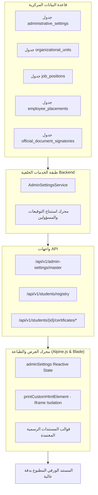

# المعمارية الشاملة لمنظومة الطباعة الرسمية والربط بالإعدادات الإدارية المركزية
**نظام إدارة المعاهد التخصصية والتعليم الأصيل — وثيقة المرجع المعماري**

---

## 1. الغرض والأهداف
تهدف هذه الوثيقة إلى وضع الأساس المعماري الصارم لربط **كافة المطبوعات والمستندات والتقارير الرسمية** المستخرجة من المنظومة، وبشكل خاص من:
1. **سجل الطلاب العام والملفات المعتمدة (Central Student Registry)**.
2. **الشهادات الرسمية (شهادات القيد والتعريف، حسن السيرة والسلوك، الإفادات)**.
3. **التقارير التفصيلية والسرية لملفات الطلاب**.
4. **بطاقات الطلاب الجامعية/المدرسية الرقمية**.
5. **كشوفات الرصد والحضور والإنذارات الرسمية**.

بالمصدر المركزي الموحد للحقيقة الإدارية: **صفحة الإعدادات الإدارية 🏢 (بيانات وشعار المعهد المركزية، الهيكل التنظيمي، والتوقيعات المعتمدة)**.

---

## 2. معمارية تدفق البيانات (Data Flow Architecture)

---

## 3. مبدأ المرجع الواحد (Single Source of Truth)
- **منع التكرار والنصوص الثابتة (No Hardcoded Strings)**: يُمنع منعاً باتاً كتابة اسم الدولة، الهيئة المشرفة، اسم المعهد، أسماء المسؤولين، أو الصفات الوظيفية كنصوص ثابتة داخل ملفات العرض Blade أو دوال الـ JavaScript.
- **الارتباط الديناميكي الفوري**: أي تعديل يُجريه مدير النظام في صفحة الإعدادات الإدارية (مثل: تحديث اسم المعهد، استبدال الشعار، تغيير مسجل الكلية أو المدير العام) ينعكس **فورياً وتلقائياً** في اللحظة نفسها على جميع نماذج السجل العام والمطبوعات دون الحاجة لإعادة تحميل أو تعديل الشيفرة البرمجية.

---

## 4. مستويات الترويسة والتذييل الرسمية

### أ. الترويسة الثلاثية الحكومية (Governmental 3-Column Header)
| الجانب | المحتوى المعتمد | مصدر البيانات المركزي |
| :--- | :--- | :--- |
| **اليمين (التبعية الرسمية)** | - دولة ليبيا - الهيئة العامة للأوقاف والشؤون الإسلامية - إدارة التعليم الأصيل - اسم المعهد المركزي - مسمى الفرع | `adminSettings.profile.state_name` `adminSettings.profile.supervising_body` `adminSettings.profile.supervising_department` `adminSettings.profile.institute_name` `branch.name` |
| **الوسط (الهوية البصرية)** | - شعار المعهد المركزي بدقة عالية (PNG/SVG) - الإدارة المصدرة للمستند | `adminSettings.profile.logo_url` أو `/images/logo.png` `document_source_label` |
| **اليسار (البيانات الأرشيفية)** | - تاريخ الاستخراج والميلادي/الهجري - الرقم الإشاري الموحد - العام الأكاديمي المعتمد - رمز التحقق الرقمي | محرك التوليد الآلي المرتبط ببيانات العام الدراسي الجاري |

### ب. تذييل التوقيعات والاعتمادات (Tri-Signature Matrix)
تعتمد الوثائق الرسمية ثلاث خانات قياسية:
1. **خانة الإعداد والمستخرج**: تظهر اسم الموظف الذي قام بالاستخراج فعلياً وتوقيته.
2. **خانة التدقيق والمراجعة**: ترتبط بوظيفة "مسجل شؤون الطلاب" أو "رئيس قسم الدراسة والامتحانات".
3. **خانة الاعتماد النهائي**: ترتبط بوظيفة "مدير فرع المعهد" أو "المدير العام للمعهد" مع خاتم المعهد الرسمي.

---

## 5. استقلالية العرض الطباعي (Print Isolation via Iframe)
- يتم استخراج المطبوعات عبر دالة الطباعة المعزولة `printCustomHtmlElement(containerId, docTitle)`.
- تُنشئ الدالة إطاراً مستقلاً تماماً (Hidden Isolated Iframe) لضمان عدم تأثر الطباعة بأنماط وتنسيقات لوحة التحكم (Tailwind dark mode، القوائم الجانبية، الأزرار، والظلال).
- يتم تطبيق قواعد الـ CSS الطباعية المعتمدة:
  - مقاس A4 قياسي (أفقي Landscape للسجلات العامة، ورأسي Portrait للشهادات والتقارير الفردية).
  - هوامش قياسية متوازنة (12mm إلى 15mm).
  - منع انقسام السجلات في منتصف الصفوف (`page-break-inside: avoid`).
  - تفعيل الطباعة بالألوان الحقيقية وشعار المعهد والختم بوضوح تام (`print-color-adjust: exact`).
