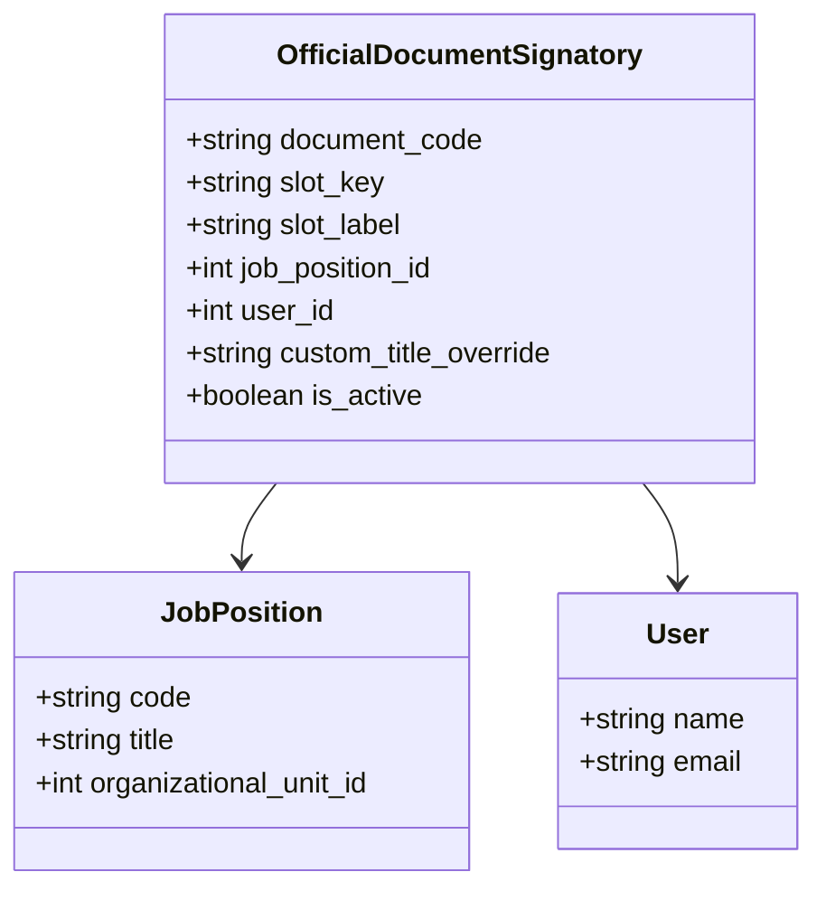

# دليل ربط الإعدادات الإدارية المركزية بالتقارير والمستندات
**بيانات وشعار المعهد المركزية، الهيكل التنظيمي، والتوقيعات**

---

## 1. جدول الإعدادات المركزية (Administrative Settings Map)

يتم تخزين كافة قيم الهوية والبيانات المؤسسية في جدول `administrative_settings` واسترجاعها عبر خدمة `AdminSettingsService`.

| المفتاح البرمجي (Key) | التسمية العربية (Label) | المجموعة (Group) | القيمة الافتراضية المعتمدة | أثرها في المطبوعات الرسمية |
| :--- | :--- | :--- | :--- | :--- |
| `state_name` | اسم الدولة | `institute_profile` | دولة ليبيا | السطر الأول بالترويسة الرسمية |
| `supervising_body` | الهيئة / الوزارة المشرفة | `institute_profile` | الهيئة العامة للأوقاف والشؤون الإسلامية | السطر الثاني بالترويسة الرسمية |
| `supervising_department` | الإدارة المشرفة | `institute_profile` | إدارة التعليم الأصيل | السطر الثالث بالترويسة الرسمية |
| `institute_name` | اسم المعهد المركزي | `institute_profile` | المعهد المتوسط للدراسات الإسلامية | العنوان الأبرز في الترويسة وجميع الشهادات |
| `branch_label` | مسمى الفرع الافتراضي | `institute_profile` | الفرع الرئيسي | يُعرض في السجلات عند غياب تحديد فرع معين |
| `phone` | هاتف المعهد الرسمي | `institute_profile` | +218 21 444 5555 | يظهر في تذييل المستندات وبطاقات الطلاب |
| `email` | البريد الإلكتروني | `institute_profile` | info@islamic-institute.edu.ly | يظهر في تذييل المطبوعات الرسمية |
| `address` | العنوان الجغرافي للمقر | `institute_profile` | طرابلس - ليبيا | يظهر في تذييل التقارير |
| `logo_url` | مسار شعار المعهد المركزي | `branding` | `/images/logo.png` | **يُطبع في منتصف الترويسة لجميع الملفات** |
| `stamp_url` | مسار الختم الرسمي | `branding` | `/storage/branding/stamp.png` | يُطبع فوق خانات الاعتماد الإداري |
| `header_title` | نص الترويسة الشاملة | `branding` | المعهد المتوسط للدراسات الإسلامية | عنوان ترويسة التقارير والكشوفات |
| `footer_text` | نص التذييل القانوني | `branding` | المعهد المتوسط للدراسات الإسلامية - إدارة التعليم الأصيل | يُطبع أسفل كل ورقة مستخرجة |

---

## 2. مصفوفة التوقيعات والاعتمادات الرسمية (Signatories Matrix)

ترتبط التوقيعات بجدول `official_document_signatories` مع إمكانية التخصيص لكل مستند:



### أكواد المستندات المعتمدة (Document Codes):
1. `student_registry`: سجل الطلاب العام والملفات المعتمدة.
2. `enrollment_cert`: شهادة قيد وتعريف طالب معتمدة.
3. `conduct_cert`: شهادة حسن سيرة وسلوك وانضباط أكاديمي.
4. `secret_report`: التقرير السري الشامل لملف الطالب والفرع.
5. `attendance_sheet`: كشوفات حضور وغياب الطلاب.
6. `warning_notice`: إشعار إنذار غياب رسمي للولي والطالب.
7. `transcript`: كشف الدرجات الأكاديمي المعتمد.

### قنوات التوقيع (Slots):
- `prepared_by`: مستخرج الكشف / الموظف المختص.
- `verified_by`: مراجع السجل / مسجل شؤون الطلاب.
- `approved_by`: معتمد الوثيقة / مدير عام المعهد أو مدير الفرع.

---

## 3. الدالة المساعدة في واجهة المستخدم (Helper Method in Alpine.js)

لضمان سهولة ومرونة قراءة أي صفة توقيع في أي قالب طباعة، يتم توفير الدالة المساعدة:

```javascript
getSignatoryInfo(docCode, slotKey, fallbackLabel, fallbackName) {
    if (!this.adminSettings || !this.adminSettings.signatories) {
        return { label: fallbackLabel, name: fallbackName, title: fallbackLabel };
    }
    const sig = this.adminSettings.signatories.find(
        s => s.document_code === docCode && s.slot_key === slotKey && s.is_active
    );
    if (!sig) {
        return { label: fallbackLabel, name: fallbackName, title: fallbackLabel };
    }
    
    // استنتاج اللقب الوظيفي
    const title = sig.custom_title_override || (sig.job_position ? sig.job_position.title : fallbackLabel);
    
    // استنتاج اسم الموظف الفعلي
    let name = sig.user ? sig.user.name : '';
    if (!name && sig.job_position_id && this.adminSettings.placements) {
        const placement = this.adminSettings.placements.find(
            p => p.job_position_id === sig.job_position_id && p.is_current && p.status === 'active'
        );
        if (placement && placement.user) {
            name = placement.user.name;
        }
    }
    return {
        label: sig.slot_label || fallbackLabel,
        title: title,
        name: name || fallbackName
    };
}
```
